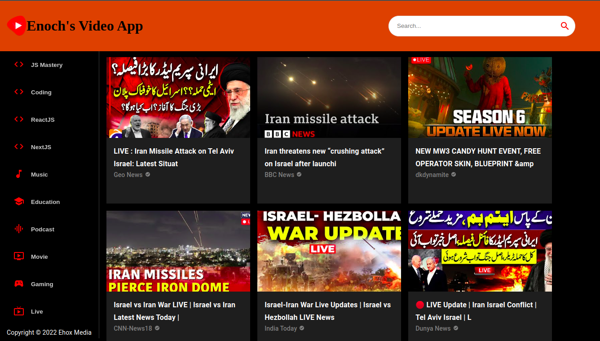

# YouTube Clone - Video App

A simple YouTube-like video app built using **React**, **RapidAPI**, and **Material-UI**. This app allows users to search for and watch videos, leveraging the YouTube API from RapidAPI.

## Features

- Browse and search for videos.
- Watch video content.
- Responsive and modern UI built with Material-UI.
- Powered by the YouTube API via RapidAPI.

## Technologies Used

- **React**: Front-end framework for building the user interface.
- **RapidAPI**: Used to fetch video data from the YouTube API.
- **Material-UI**: Provides ready-to-use, responsive UI components.

## Installation

Follow the steps below to set up and run the project locally.

1. Clone the repository:
    ```bash
    git clone https://github.com/Enochflames/Video-App
    ```

2. Navigate into the project directory:
    ```bash
    cd your-repo
    ```

3. Install the necessary dependencies:
    ```bash
    npm install
    ```

4. Create a `.env` file in the root directory and add your RapidAPI key:
    ```bash
    REACT_APP_RAPIDAPI_KEY=your_rapidapi_key
    ```

5. Start the app:
    ```bash
    npm start
    ```

6. Open your browser and visit:
    ```
    http://localhost:3000
    ```

## API Configuration

This app uses the **YouTube Data API** via RapidAPI to fetch video data. Make sure to sign up on [RapidAPI](https://rapidapi.com) and subscribe to the YouTube API, then copy your API key into the `.env` file as shown in step 4.

## Screenshots



## Contributing

Feel free to fork the repository and submit pull requests. Contributions are welcome!

